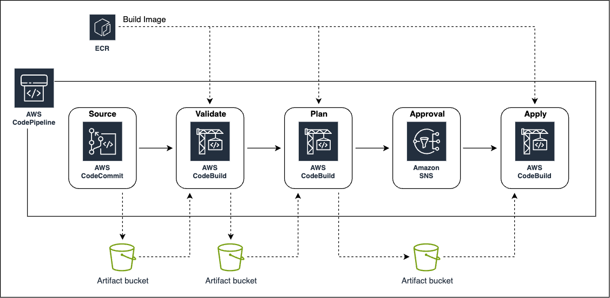

# Automated infrastructure deployment with Terraform

Integrating Terraform as an IaC practice on AWS usually requires only a local CLI to deploy resources. Commands like `terraform plan`, `terraform apply`, and `terraform destroy` should be familiar to everyone who has been using Terraform for some time.

&nbsp;

While using local machine to execute Terraform CLI commands is a valid approach when first starting out and getting some experience, it prevents people from unlocking Terraform’s full potential.

Like with any other programming language, IaC tools provide the ability to leverage full benefits of CI/CD workflows for infrastructure deployments. Switching from manual infrastructure orchestration via local CLI command to automated CI/CD pipelines should therefore be the goal of every team that wishes to use Terraform more efficiently.

&nbsp;

Automated pipelines allow for more efficient team collaboration, reliable infrastructure reviews and tests as well as more consistent resource deployments. Therefore, changes can be shipped more quickly and reliably while ensuring that company security standards and compliance policies are met.

&nbsp;

The architecture include an AWS CodePipeline with multiple stages that consist of CodeCommit, CodeBuild, and Approval stages. AWS CodBuild uses a custom Docker image stored in an AWS ECR. The pipeline artifacts between stages are all stored in an S3 Bucket.

1.  **Source**: The entry point for the pipeline, contain Terraform code to deploy
2.  **Validate**: Used to validate the Terraform configuration and to run automated security and compliance checks. This stage aims to follow the `fail fast` philosophy to ensure that mistakes and compliance breaches are detected as soon as possible.
3.  **Plan**: Compare Terraform configuration with the existing AWS infrastructure and to evaluate the changes Terraform intends to make. This ensures that only the changes that were reviewed are applied later.
4.  **Approval**: Guarantee that the Terraform plan has been reviewed before the deployment
5.  **Apply**: Once the Terraform plan output has been reviewed and approved, `terraform apply` is run to deploy out Terraform configuration

&nbsp;

The **Validation** stage contains multiple steps that are all part of the validation workflow and are executed sequentially.

The first action is the execution of the Terraform native validation command `terraform validate`. Validate runs checks that verify whether a Terraform configuration is syntactically correct and internally consistent.

&nbsp;

After the Terraform validation, `tflint` command is executed. TFLint is a linter for Terraform that analyze Terraform configuration for possible errors and to enforce best practices and stylistic conventions. This ensures consistent code quality and adherence to coding guidelines within our development team.

&nbsp;

The next command to run is `checkov`. Checkov is a static code analysis tool for IaC that detects security and compliance misconfigurations before the Terraform code is deployed. It offers a wide range of built-in policies that cover AWS security and compliance best practices. Using a static analysis tool like Checkov at the beginning of a CI/CD workflow ensure that security risks and compliance breaches are detected and remediated as soon as possible.

&nbsp;

The last is a `trivy` scan of the whole Terraform configuration. Trivy is a comprehensive and versatile security scanner. Trivy provides built-in checks to detect configuration issues in popular IaC files such as: Docker, Kubernetes, Terraform, CloudFormation, and more

&nbsp;

Because CodeBuild will do the creation of all resources provided in Source stage, CodeBuild IAM role should have the **AdministratorAccess** permisson to be able to create other AWS services.

&nbsp;
